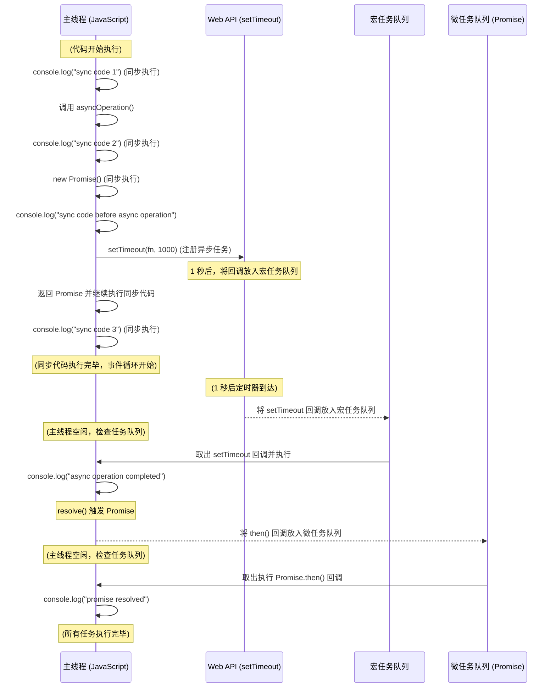

## Event Loop

众所周知，JavaScript 是单线程语言，同一时间只能执行一个任务。  
然而它具备非阻塞 I/O 模型，可以并行处理多个任务。

事件循环（Event Loop）正是关键所在：

- **主线程调用栈（Call Stack）**
- **宏任务队列（Macro Task Queue）**
- **微任务队列（Micro Task Queue）**

事件循环伪代码：

```javascript
while (queue.waitForMessage()) {
  queue.processNextMessage();
}
```

更细致的版本：

```js
function runJs() {
  let syncStack = [] // 同步执行栈
  let asyncMicroQueue = [] // 异步微任务队列
  let asyncMacroQueue = [] // 异步宏任务队列

  function runSyncStack() { // 主线程
    while (syncStack.length) syncStack.pop()() // 清空同步执行栈
    reRender() // 重新渲染
    runAsyncQueue() // 从任务队列取出异步任务执行
  }

  function runAsyncQueue() { // 任务队列
    while (asyncMicroQueue.length) asyncMicroQueue.shift()() // 先清空微任务队列

    while (asyncMacroQueue.length) {
       // 每执行一个异步宏，就要清空一次微任务队列（因为有可能异步宏会往微任务队列 push 异步微）
      asyncMacroQueue.shift()()
      while (asyncMicroQueue.length) asyncMicroQueue.shift()()
    }
    runSyncStack() // 回到 JS 主线程
  }
  runSyncStack()
}
```

> 延伸阅读：[MDN Event Loop](https://developer.mozilla.org/en-US/docs/Web/JavaScript/Event_loop)

## Promise

Promise 是 JavaScript 处理异步的核心对象，支持链式调用，让异步代码更易维护。它有三种状态：`pending`、`fulfilled`、`rejected`。

```js
function asyncOperation() {
  console.log('sync code 2');
  // sync code
  return new Promise((resolve, reject) => {
    // return a promise for async operation
    console.log('sync code before async operation');
    // start async operation
    setTimeout(() => {
        console.log('async operation completed');
      // async operation is completed, resolve the promise
      resolve();
    }, 1000);
  });
}
console.log('sync code 1');
asyncOperation().then(() => {
  console.log('promise resolved');
});
console.log('sync code 3');
```

输出：

```
sync code 1
sync code 2
sync code before async operation
sync code 3
async operation completed
promise resolved
```

在 Promise 状态流转过程中，可以用如下时序图来理解事件循环与任务队列的协作：



## Async/Await

`async/await` 是基于 Promise 的语法糖：

```js
async function asyncOperation(){}
// equivalent to
function asyncOperation() {
  return Promise.resolve();
}
// equivalent to
function asyncOperation() {
  return new Promise((resolve, reject) => {
    resolve();
  });
}
```

```js
async function main() {
  asyncOperation().then(() => {
    console.log('promise resolved');
  });
  // equivalent to
  await asyncOperation();
  console.log('promise resolved');
}
```

## Recap

- 事件循环是 JavaScript 的并发调度机制
- Promise 使用状态机封装异步操作
- async/await 让异步代码看起来像同步逻辑

