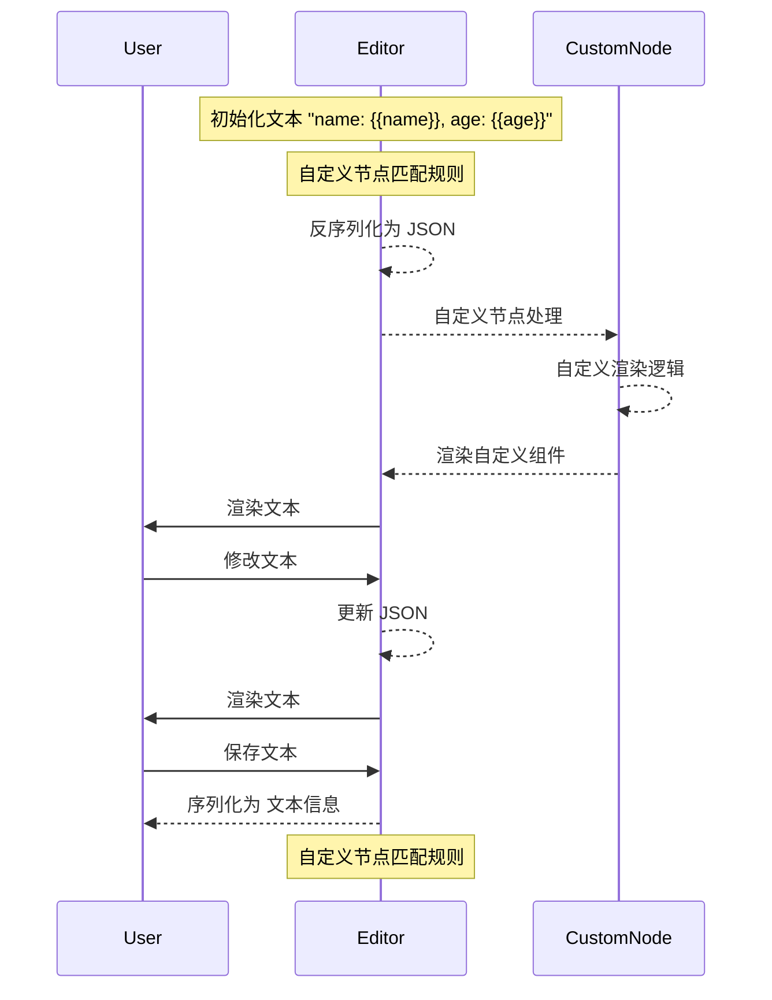

> 更新于 2025-02-05。

## Core Concept

- **Editor**：核心编辑器实例
  - **Node**：内容节点
  - **Mark**：文本格式
  - **Extension**：功能扩展
- **Schema**：文档结构
- **Commands**：操作编辑器的命令
- **Plugins**：扩展编辑器自定义能力
- **State**：当前文档状态

## Design



## What

一个自定义富文本编辑器。

## How

通过自定义节点实现自定义渲染。

## Core Code

```tsx
const View = ({ node, updateAttributes }: NodeViewProps) => {
    const { type, value, options, placeholder } = node.attrs;

    const handleInput = (e: React.FormEvent) => {
        const inputElement = e.target as HTMLInputElement;
        const newValue = inputElement.value || "";
        updateAttributes({ value: newValue });
    };

    // dynamic width of input
    const count = caculteWidth(value ? value : placeholder);

    return (
        <NodeViewWrapper as="span">
            <NodeViewContent
                as={"input"}
                style={{ width: `${count}rem` }}
                contentEditable={false}
                onInput={handleInput}
                placeholder={placeholder}
                defaultValue={value}
            ></NodeViewContent>
        </NodeViewWrapper>
    );
};

const InlinePlaceholder = Node.create<InlinePlaceholderAttributes>({
    renderHTML({ HTMLAttributes, node }) {
        const attrs = mergeAttributes(
            this.options.HTMLAttributes || {},
            HTMLAttributes,
        );
        return ["span", attrs, 0]; // 0 or child of span
    },
    addNodeView() {
        return ReactNodeViewRenderer(View);
    },
});
```

